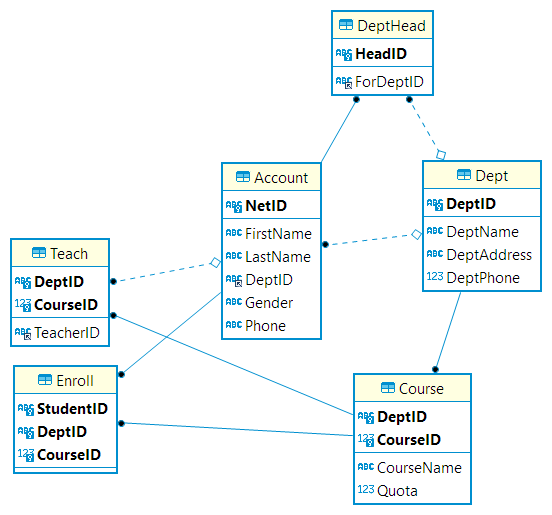

# College info database
client: Vue3, server: JDK11 Javalin REST service

# Build Instruction
1. Create any SQL-compliant server
2. Run main.sql on /db/
3. Edit DBUtil to connect JDBC to the server being set up.
4. Run ./gradlew test to populate test data
5. Run ./gradlew run to build and run the project
6. The webserver is started on PORT determined by constants defined in App.java

# Hosted Instance

## URL:
http://gcp-wormfeed.duckdns.org:8002/

## Sample Account:
>(netid=122235d, pin=122235dChan)

## Web Interface

  

## Database schema

